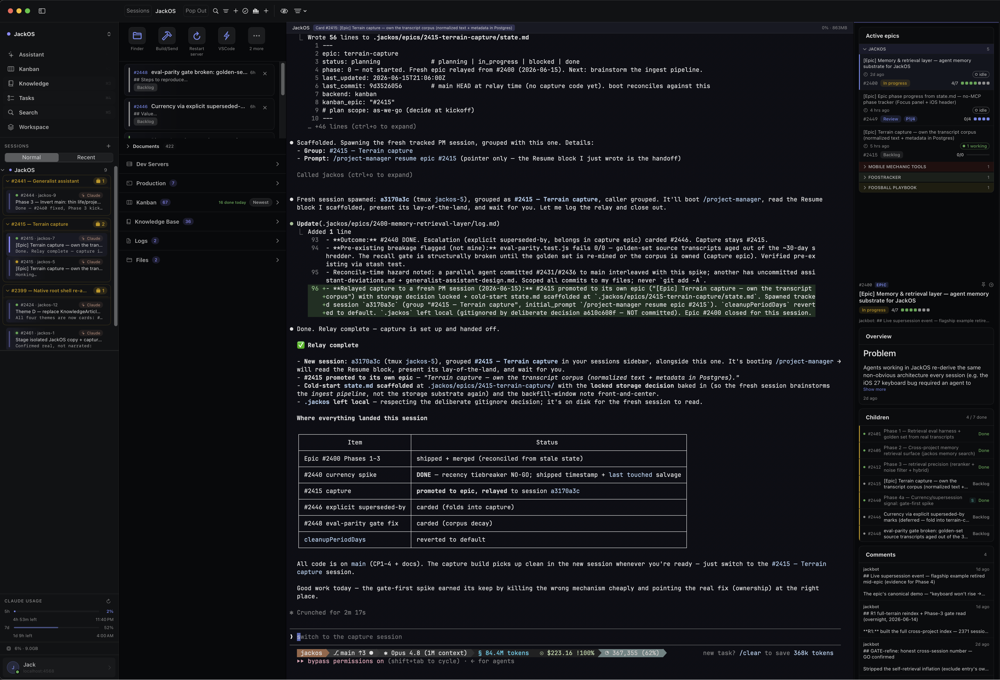

# Personal AI Agent Orchestration Platform

> A native macOS and iOS app over a Node.js/Fastify backend that runs my agent work end-to-end. Used daily on a Mac Studio.

**Status:** Production, daily use
**Role:** Solo builder
**Stack:** Swift (macOS + iOS), Node.js / Fastify, PostgreSQL, Claude Agent SDK, MCP, Tailscale, Caddy, launchd
**Live:** Private (used internally)

## Why it exists

I started this in late January 2026 to track the work my agents were doing. The first version was a kanban so I had somewhere to look when an agent handed a repo off to the next one. From there it grew into the platform I actually use to plan, dispatch, and supervise everything I ship. The platform is fully built by agents running through it, including the SQLite to Postgres migration and most of the native Swift surface.

It runs on my Mac Studio under launchd, behind Caddy, with Tailscale for remote access. About 95% of my coding work goes through it now.

## What I built

- A Node.js / Fastify backend with about 49 Postgres tables covering kanban, dispatch, sessions, knowledge base, terminal sessions, cron jobs, profiles, and approvals. Long-running, supervised by launchd.
- A native SwiftUI app, dual-target for iOS 18 and macOS 15, with around 76k lines of Swift across 351 files. Six main tabs (Assistant, Kanban, Knowledge, Ideas, Search, Workspace) plus a menu-bar Quick Panel and multi-window scenes on macOS.
- An assistant agent loop on top of the Claude Agent SDK, with a unified session service that normalizes streaming events, classifies SDK errors, and routes tool approvals back to the user via push.
- A custom MCP server (separate Node process) with 11 tool modules. Two entry points: a full server and a project-scoped one that auto-injects `project_id` and exposes a smaller surface, since agents do not need everything the human client needs.
- A dispatch system where the assistant acts as PM and spawns specialized workers (backend, SwiftUI, MCP, test-writer). Runtime SDK handles live in memory, persistent state lives in a `dispatches` table, and a worker-core protocol prompt is injected through `canUseTool` so the PM never sees it but every worker does.

## Key technical challenges

**Three clients, two response shapes.** The Vue SPA, the native Swift app, and the MCP server all hit one Fastify backend, but agents need a different response shape than humans. I added a transformation layer in the MCP path that strips visual metadata (colors, timestamps, ordering hints, layout positions) before agents see the payload. The internal API stays full-fidelity, humans get the rich shape, agents get a token-lean version of the same data. The project-scoped MCP entry point goes further and only exposes the tools agents should reach for, since giving them everything turned out to be more friction than it saved.

**The persona refactor.** I started with a single general assistant. After a few weeks it was clear that a team of specialized personas, marketing advice from a marketing-shaped agent, design questions from a design-shaped one, would be more useful than one assistant trying to be everything. The migration was real work: a singleton on disk at `~/.assistant/` had to become a directory of profiles at `~/.assistants/{name}/`, with shared content extracted into `~/.assistants/_core/`. The script (`migrate-singleton.js`) is idempotent, runs on every boot, and returns `migrated: false` once it has done its job. The existing assistant chat session is wired into the main profile so nothing is lost in the move.

**Orphan reconciliation on boot.** I did not write this defensively. I wrote it after a server restart left a handful of dispatches stuck mid-run, claimed by SDK handles that no longer existed. The fix is a `reconcileOrphans` step that runs before the assistant routes register: any dispatch in a non-terminal state without a live runtime handle gets reconciled, either reattached if it can be, or marked failed with a reason. Combined with `sdk_session_id` persistence on the assistant sessions table, the system survives a restart cleanly now. From what I have seen, this kind of thing is easier to design once you have actually been bitten by it.

**Native SwiftTerm migration.** The terminal in the iOS app started as a WebView inside a Capacitor shell. I wanted to learn Swift, get a real iOS feel, and bet on better terminal performance, so I bridged the Vue client to a native SwiftTerm view first. That worked well enough that I forked the iOS target into a dual build: hybrid Capacitor and pure SwiftUI in parallel. I kept using the Capacitor build daily while the native one came up tab by tab. Once native covered my daily surface, I retired Capacitor on March 28. The dual build was a deliberate hedge, not a panic move, and it gave me a safe runway to learn SwiftUI without breaking my own workflow.

## What I'd do differently

If I started over, I would probably skip MCP and lean on plain bash commands instead. MCP adds a transformation layer that I am not sure earns its place against a smaller token cost on the bash side. I am running an active CLI vs MCP coexistence experiment right now, instrumenting both call paths, to actually validate that hunch before I tear anything out. Outside research suggests CLI uses fewer tokens. My own data is too early to tell. I want to make this call from numbers, not vibes.

## Screenshots / Demos

*The platform mid-orchestration. When a working session's context fills, a custom relay skill checkpoints the active epic's state and a what's-done / what's-next handoff, then spawns a fresh tracked agent session through the MCP server, so long-running work continues across sessions without losing the thread. The right panel tracks active epics across projects.*

A native terminal walkthrough and live demo available on request.

## Closing

This is the system I open every morning. The platform that runs agents is the platform agents have been building, and most of the work that went out this quarter went out through it.
