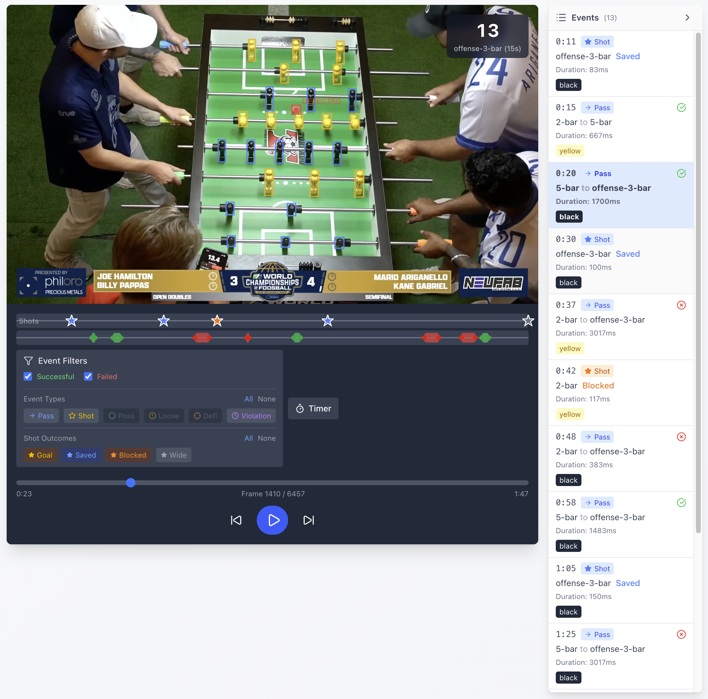

# Foosball Ball + Player Tracking with YOLO11

> A computer vision pipeline that tracks the ball, players, and game events in real foosball footage. Python/FastAPI backend, React frontend, custom-trained YOLO11 model. Codenamed Foostracker.

**Status:** Active development, personal use
**Role:** Solo builder
**Stack:** Python, FastAPI, SQLite, SQLAlchemy, Ultralytics YOLO11, OpenCV, ByteTrack, PyTorch, CoreML, React, TypeScript, Vite, TanStack Query, Tailwind, Label Studio
**Live:** Local-only, demo on request

## Why it exists

Foostracker started as a proof of concept. I had never explored computer vision before and wanted to see if I could even build something like this. I play competitive foosball at a local club that records matches, so the raw footage was already there. The question was whether I could turn it into something useful.

The first version was pure OpenCV with HSV color tracking. It mostly worked on a single table under consistent light, and fell apart everywhere else. That pushed me into YOLO, which pushed me into building a real training dataset, which pushed me into the rest. Five numbered iterations and a parallel CoreML branch later, spanning September 2025 to March 2026, the system tracks shots, passes, and rod possession well enough to feed Foosball Playbook, my top-down Tornado T3000 simulator, which plays the recorded game back as an animation on the simulated table. Real footage in, animated tactical replay out. That closed loop is the reason I keep working on it.

## What I built

- A two-service web app: FastAPI backend that runs the video pipeline as a background task, React 19 + Vite SPA that handles upload, calibration, playback, and event review.
- A three-phase video pipeline. Phase 1 runs YOLO11 detection per frame plus ByteTrack for player identity and a custom rod-constrained ball tracker. Phase 2 runs a pluggable classifier system over the stored frame data with an `on_departure` / `on_transit` / `on_resolution` / `on_timeout` lifecycle. Phase 3 is an optional CNN+LSTM enrichment layer that is currently turned off.
- Pluggable classifiers for pass detection, shot detection, intent (shot vs pass vs fumble at departure), ball-on-rod timing, rod possession, and ITSF time violations. Around 5,907 lines of classifier code across nine modules.
- A two-tool labeling pipeline. Bounding boxes in Label Studio, action labels (shots, passes, possessions) in custom React UI inside Foostracker, since the action data ties directly to game events the app already understands.
- Multi-backend inference: PyTorch `.pt` for compatibility, CoreML `.mlpackage` for the Apple Silicon path, swappable at runtime.
- A replay export service that writes an interchange format consumed by Foosball Playbook for animated playback on the simulated table.

## Key technical challenges

**HSV color tracking could not survive lighting variation.** The first version leaned on the high contrast of a foosball table: green surface, pink ball, black and yellow players. It worked under one set of lights and produced a steady stream of false positives across bar setups, club lights, and professional venue footage. Color thresholding cannot handle that range. I moved to YOLO11, labeled my own dataset, and trained a 3-class detector for ball, black player, and yellow player. The current `v5-blur6` run hits 0.9923 mAP50 and 0.9459 mAP50-95 at 50 epochs on a held-out set. That fix earned its keep and made the rest of the pipeline possible.

**Motion blur on fast shots dropped the ball.** The trained model worked on calm footage and lost the ball during real shots, where it blurs to a streak in a single frame. I built a custom synthetic-blur augmentation pipeline with five presets (heavy horizontal, extreme horizontal, reverse medium, two diagonals) that generated 3,145 augmented frames from 393 ball-positive originals. Targeting the failure mode directly worked better than throwing more raw footage at the problem.

**Two-phase pipeline so I could iterate on classifiers without re-running YOLO.** Inference is expensive. I split the pipeline so Phase 1 runs detection and tracking once and writes per-frame data to SQLite, and Phase 2 runs the rule-based classifiers over that stored data on demand. Adding a new event type or tweaking a heuristic does not cost another video pass. The classifiers share a `FrameContext` object carrying ball position and velocity in inches per second, current rod zone, and possession state. Adding a new classifier is one new file plus one registration line.

**CoreML performance bet.** I wanted to know if Apple Silicon could meaningfully beat PyTorch on inference, partly out of curiosity and partly because real-time playback needed the headroom. I built a multi-backend inference layer that loads either the `.pt` or the `.mlpackage` and switches at runtime. CoreML on the Neural Engine clears 60+ FPS on my Mac. PyTorch on the same hardware sits around 13 to 15 FPS. The bet paid off, and I learned the Apple inference stack along the way.

## What I'd do differently

I'd skip the CNN+LSTM trial earlier. I built a sequence model for shot-type and outcome classification, set up shadow-mode infrastructure with a `classification_source` field and an agreement-rate target, ran it alongside the heuristics, and the ML output was not better than the rules. I turned it off. The infrastructure is still in place because I plan to revisit it when the trade-off changes, but if I were starting over I would lean on heuristics from the start and earn the model later, given how this run played out.

## Screenshots / Demos

*The analysis UI running on real tournament footage. The custom YOLO11 model detects the players and ball live, while the event panel classifies each pass and shot by bar position, duration, and outcome (Saved / Blocked / Goal / Wide).*

A demo and additional tracking footage available on request.

## Closing

I started this without knowing how computer vision worked. It is now a system that classifies shots and passes, times rod possessions, models the ITSF rules I play under, and feeds an animation simulator I built next to it. The model is not done improving, but it is already what I open when I want to study a match.
