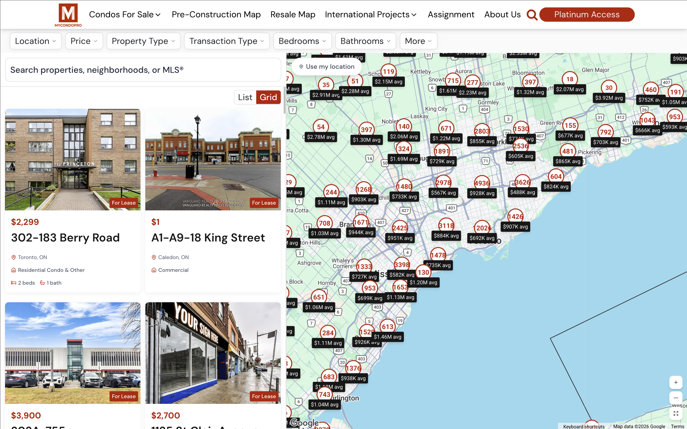
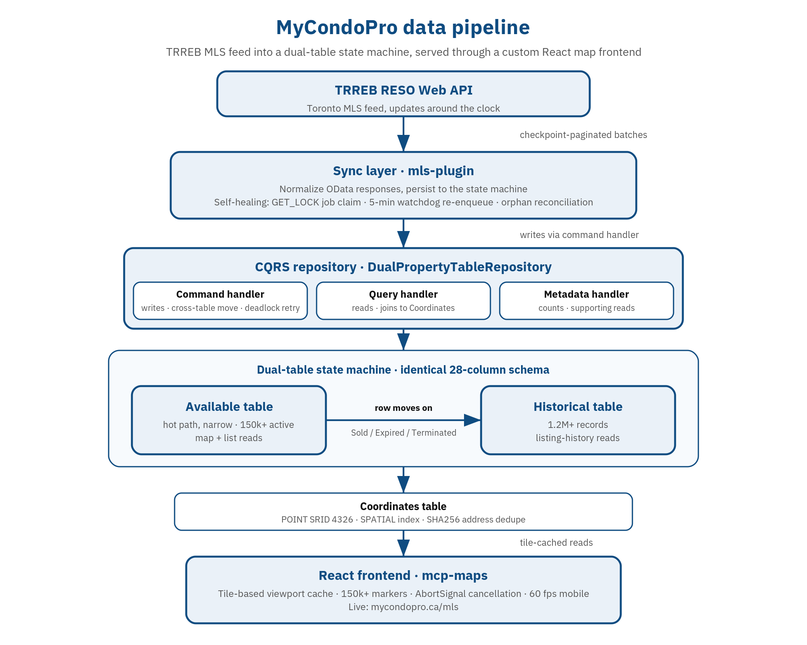

# MyCondoPro: RESO MLS Sync and Custom Map Search at Scale

> A WordPress plugin suite that syncs the TRREB MLS feed into a dual-table state machine, then renders it through a custom React + Google Maps frontend. 150k+ active listings, 1.2M+ historical records, end-to-end solo build.

**Status:** Production. Active maintenance, ongoing performance work.
**Role:** Solo lead engineer
**Stack:** PHP 8, WordPress, PHP-DI, Action Scheduler, MySQL (FTS, spatial geometry, custom UDFs), Google Geocoding API, React 18, TypeScript, Vite, Tailwind v4, TanStack Query v5, Zustand, @vis.gl/react-google-maps
**Live:** https://mycondopro.ca/mls

## Why it exists

MyCondoPro is a Toronto-area real estate site that needed a full MLS surface inside WordPress: a live map of every active listing, search and filtering at scale, listing detail pages with full history, and an admin layer that could keep the data honest against a feed that updates around the clock. The TRREB RESO Web API publishes the data; the rest of the system did not exist.

I came in as the only engineer and built it end-to-end. Backend, frontend, database design, the operations layer that keeps it running, the live deployment. The plugin suite has lived in production through the whole cycle, and most of what's interesting about the codebase came out of running it under real conditions.

## What I built

The system is a six-plugin WordPress suite. Two of those plugins carry the case study, and the other four are infrastructure built around a shared parent plugin.

The backend half (`mls-plugin`) is the writer of property data. It pulls listings from the TRREB (Toronto Regional Real Estate Board) RESO Web API in checkpoint-paginated batches, normalizes the OData responses, and persists them into a **dual-table state machine**: one table for Available listings and one for Historical, sharing an identical 28-column schema. When a listing's contract status flips to Sold, Expired, or Terminated, the row physically moves from Available into Historical, atomically, inside a single command handler. Map searches and list views read from Available, which stays narrow and fast. Listing-history rendering reads from Historical, which carries the long tail.

I tried MySQL partitioning first. The two-table split was the call that stuck. Partitioning could have kept one logical table while splitting storage, but the operational complexity and the asymmetric access patterns made a clean two-table split simpler to reason about and faster on the hot path. The Available table is the most-queried surface in the system, and keeping it physically narrow was the single biggest performance lever I had.

I came in with an OOP background and wanted to apply that to PHP properly, so the repository layer was a deliberate CQRS-inspired split from day one of the dual-table design. `DualPropertyTableRepository` decomposes into a `PropertyCommandHandler` (writes, including the cross-table move and a deadlock retry with exponential backoff), a `PropertyQueryHandler` (reads, joining to Coordinates as needed), and a `PropertyMetadataHandler` (counts and supporting reads). Every plugin in the suite uses PHP-DI, with `mcp-core` hosting the container and addons extending it via filter, so the handler split fits inside a consistent architecture across the codebase rather than living as a one-off.

The shared `mcp-core` plugin is the parent in a parent-child plugin platform I designed for the suite. Addons (auth, forms, MLS, maps, template addons) extend the parent's PHP-DI container via filter, reuse logic without duplication, and stay loosely coupled so one addon's failure doesn't pull the others down. `mcp-core` hosts the Template Loader, Cache, Mailer, Logger, and an in-house Email Template Registry that produces branded emails consistently across plugins. The other three addons (`mcp-authentication`, `mcp-form`, `mcp-template-addons`) handle conventional auth, Keap CRM form sync, and shortcodes on top of that platform.

Address geocoding sits in a third table. I dedupe against a SHA256 hash over normalized address components (street number, street name, city, province, postal code), with a province standardization map and a small bit of logic that strips Toronto district suffixes (e.g. "Toronto C01") before hashing. A hash lookup is much faster than indexed multi-column equality, and since the canonical addresses come from Google's geocoder, the inputs are stable enough that the hash is stable too. Coordinates are stored as `POINT NOT NULL SRID 4326` with a `SPATIAL` index, so map queries lean on real geometry rather than bounding-box math in PHP.

The frontend half (`mcp-maps`) is a React 18 + TypeScript + Vite app, served as a WordPress plugin shortcode and embedded into MyCondoPro's custom Oxygen-built theme. The theme was originally built in Oxygen Builder with a lot of custom code and PHP snippets, so I built the React shortcodes against the same CSS variables the theme already exposed. The design system stays consistent between hand-rolled theme code and the plugin-injected components, instead of looking like two products glued together. Live URL: https://mycondopro.ca/mls.

The system runs as a single-tenant production deployment for MyCondoPro. The per-install settings shape (`MapSettingsController`, `SoldListingsSettingsController`) is future-proofing in case it gets deployed for another client. Honest framing: single tenant today, ready for more if needed.

## Key technical challenges

**The unreliable server, and how the self-healing came out of it.** The hosting environment was not stable. Random server timeouts left the replication job stuck mid-run, and without a watchdog the data would silently fall behind. The visible symptom for users was stale listings, not 500s, which made it worse: I'd find out the feed had been frozen for hours because nothing in the system was telling me. For a stretch I was babysitting the plugin, manually checking and restarting it whenever I noticed.

The self-healing stack came out of getting tired of that. Each replication job claims a MySQL `GET_LOCK` named lock at the start and releases it in `finally`, so a clean exit always frees the slot. A monitor job runs every 5 minutes; if it finds a `JOB_RUNNING` flag whose `JOB_START_TIME` is older than 600 seconds with no live Action Scheduler action behind it, it releases the stale lock and re-enqueues the work. Admins can flip a `FORCE_STOP_REQUESTED` option to abort a running sync gracefully without going to the database, and the job checks that flag at start and again before chaining the next page. Orphan reconciliation cleans up the cases where a job died between updating its state and being recorded as complete. None of that was preventive engineering. It was earned, after the manual-restart phase.

**Mega-batch coordinator for bulk geocoding.** This one was preventive. Action Scheduler has a 300-second hard timeout per action. With 1,000+ un-geocoded coordinates and a 50 req/sec rate limit on Google, a naive bulk retry would blow past the timeout. I built a coordinator that splits the work into chunked progress steps and recovers per-chunk on errors, before the timeout could bite. Backed by an admin dashboard with status filters, AJAX bulk retry, and manual coordinate entry for the addresses that the geocoder couldn't resolve cleanly.

**Tile-based viewport caching on the map.** The frontend needed to render 150k+ active markers across the GTA without melting the browser. The viewport is broken into XYZ tiles, each tile fetched and cached individually via TanStack Query, so panning back over previously-seen area reuses cached data instead of re-fetching. Multiple tiles in the same render cycle batch into one server request via a small batch scheduler (10 tiles, 50ms maxWait). Stale time of 30 minutes, gcTime of 2 hours. The numbers were tuned by intuition against how often the RESO feed pushes new data: long enough to absorb panning, short enough that users don't see materially stale listings.

**Progressive marker loading and viewport cancellation.** Available markers fetch first as Priority 1 and render immediately. Sold markers fetch in parallel as Priority 2 and fade in over 300ms when ready. Pan or zoom that supersedes a pending fetch cancels the in-flight request via `AbortSignal` before issuing the new one, so the map never finishes drawing yesterday's viewport on top of today's.

**The mcp-maps v2 rewrite.** v1 worked. v2 was mostly a craft and curiosity rewrite: I wanted to do it the right way, lean into newer tools, and clean up architectural choices I'd outgrown. v2 reorganizes by feature domain (`features/map`, `features/filters`, `features/listings`, etc.) instead of by type. State management moved from one monolithic Zustand store with a React `FilterProvider` context to 10 specialized filter stores, each composed against a `baseFilterStore` for `AbortController` lifecycle and reset semantics. v1 still lives behind a `?v1=true` URL flag, gated for safe rollback rather than deleted.

The design system was my first serious dive into Tailwind. The 10 typed token modules (animation, border, color, glass, interaction, mobile, shadow, size, spacing, typography) came partly from learning the tool properly on a real project, and partly from the constraint of mirroring the existing brand styling from the Oxygen-built theme. Tailwind v4 with CSS-variable-first configuration made the brand-fidelity side workable.

The one piece of v2 that was earned the hard way was the GPU and blur lifecycle subsystem. Maps are heavy when you have 100k+ markers across GTA inventory, and v1's static `backdrop-blur` declarations and untracked `will-change` hints turned the live site into a slideshow on real mobile devices. v2 has a `WillChangeManager` LRU singleton with a 10-element cap and a 250ms idle cleanup, an allowlist limited to `transform` and `opacity`, mobile blur tiers (8 to 12px on mobile against 20 to 32px on desktop) routed through CSS variables, and an explicit 60 FPS budget. Memoization coverage went from sparse to roughly 75% of components. That part was forced by real devices, not preference.

## What I'd do differently

**Greenfielding this today, I'd probably lean Laravel.** WordPress is the right tool for plenty of jobs, and what I built lives in production on it without complaint. For a real estate platform at this scale though, Laravel would have made a few things cleaner: Eloquent over the dual-table model, queues over Action Scheduler, a real service container instead of one I had to bootstrap inside a plugin parent. My current Rigital work (ShopFlow CRM) is Laravel-based, so this isn't retrospective revisionism, it's pattern recognition from where I've actually been shipping.

**The FTS trigger and UDFs should have lived in a migration, not on the database.** I authored the `BEFORE INSERT/UPDATE` trigger that populates the `va_fts_all` full-text column, plus four custom UDFs (`try_cast_decimal`, `try_cast_boolean`, `try_cast_integer`, `fn_json_array_to_fts_string`) that the trigger leans on. They work, and the FTS-backed autocomplete on top of them is one of the better surfaces in the app, but I applied the DDL directly to the database. It should have lived in a versioned migration alongside the plugin schema, the same way the table definitions do. Rebuilding any of the suite somewhere new is harder than it should be because of that gap.

**I'd have preferred Postgres over MySQL.** Postgres has the cleaner story for spatial geometry and full-text search, and PostGIS would have replaced a bunch of careful MySQL plumbing with primitives that work the way I wanted. The client was already on MySQL, so the trade-off was working within the existing infrastructure rather than asking them to migrate. Practical engineering call at the time, but if I were starting fresh, the database choice would be the first thing I'd revisit.

## Screenshots / Demos

*The live product at https://mycondopro.ca/mls. Clustered price markers across the GTA on real Toronto inventory, rendered next to the listing grid.*

*Data pipeline. The MLS feed syncs through a watchdog-protected Action Scheduler job layer and a CQRS-style repository into a dual-table state machine; a listing physically moves from Available to Historical on a status flip, keeping the hot query path narrow.*

Additional screenshots available on request.

## Closing

This is the codebase that taught me the most about running my own infrastructure under conditions I didn't fully control. Most "WordPress plugin developer" portfolios stop at custom post types and Gutenberg blocks. This one has a CQRS-style repository layer, deadlock-aware writes, MySQL `GET_LOCK` job claiming, watchdog recovery, a spatial index, custom MySQL FTS, and a React frontend that holds 60 FPS on real mobile devices with 100k+ markers in play. Solo build, end-to-end, still live.
