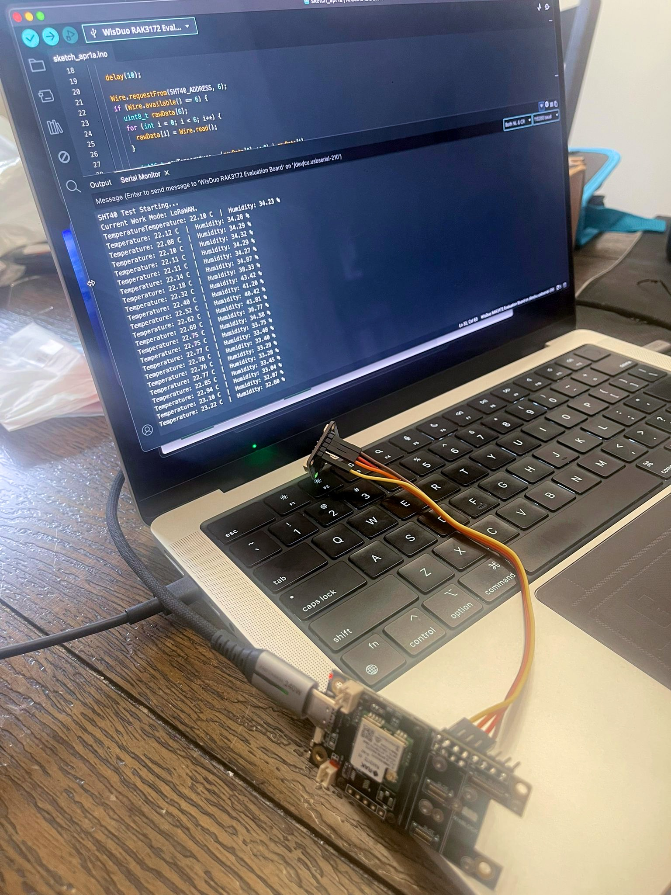
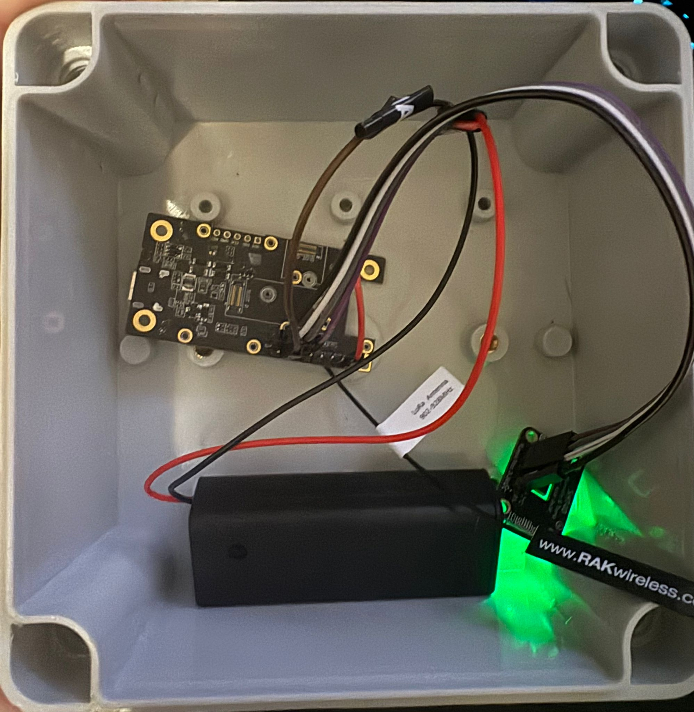
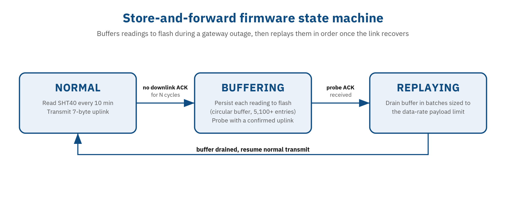

# Temperature Monitor: LoRaWAN Cold-Chain Sensor and Cloud Backend

> Custom firmware on an STM32WLE5 module, a self-hosted LoRaWAN network server, and a multi-tenant Laravel backend, built hardware-up by one engineer.

**Status:** Active development, pre-launch. Running across multiple fridges and freezers in the builder's own home as the validation environment. Partner-restaurant deployment is the next phase.
**Role:** Solo engineer (hardware POC, firmware, backend, frontend)
**Stack:** RAK3172-E (STM32WLE5 + SX1262), SHT40 (Sensirion), RUI3 v4, LoRaWAN 915 MHz Class A, ChirpStack v4 (self-hosted, Docker), MQTT (Mosquitto), Node.js + TypeScript ingestion worker, Laravel 13 / PHP 8.5, PostgreSQL 18 + TimescaleDB, Vue 3 + Pinia + ECharts, Filament 5, Laravel Reverb
**Origin:** Concept pitched by a Toronto restaurant owner and existing Rigital client; no deployment yet, currently validated at home (product name TBD)

## Why it exists

The idea came from the restaurant side. A Toronto restaurant owner and existing Rigital client had been thinking about a cold-chain monitoring product for a while and pitched it to us: he had the manufacturing and sales relationships, we had the engineering depth. The need is real and regulatory. Canadian restaurants operating under HACCP and FDA FSMA rules are required to log temperature records for every fridge and freezer on-site. Most options in that space are either expensive commercial platforms that price out independent operators, or paper logs that live in a binder and only get scrutinised after something goes wrong.

The pitch landed, and I built it. This was also my first hardware project. I had no prior soldering experience, watched a few YouTube videos with a "I can figure it out" attitude, and had a working prototype on the bench within days. The combination of a hardware POC and a full-stack cloud backend was new territory, and honestly that was a significant part of the appeal.

## What I built

The system spans four layers: a LoRaWAN sensor node inside the fridge, a self-hosted gateway and network server, a Node.js ingestion worker, and a Laravel multi-tenant cloud backend with a Vue dashboard.

At the hardware layer, the prototype sensor is a RAK3172-E module (STM32WLE5 SoC with an integrated SX1262 LoRa radio) paired with a Sensirion SHT40 for temperature and humidity. It runs on an ER14505 3.6V lithium thionyl chloride battery in an IP67 ABS enclosure. The design places the entire unit inside the fridge or freezer rather than running a probe through the door gasket. LoRaWAN's link budget is wide enough that sub-GHz signals pass through non-conductive rubber gaskets with considerable margin to spare.

The firmware is written in C++ against the RUI3 v4 framework, RAKwireless's Arduino-style SDK for the STM32WLE5. Every 10 minutes the device wakes from deep sleep, reads the SHT40 using the high-precision command with CRC-8 validation on both temperature and humidity bytes, measures battery voltage directly from the VREFINT ADC register (the vendor's high-level battery API returns bad values on this module variant), and transmits a 7-byte payload over LoRaWAN. Between readings the chip sits in STOP2 mode, designed for ultra-low current draw per the STM32WLE5 datasheet; bench measurement is still pending. A secondary timer fires every 60 seconds to check whether temperature is outside the configured safe range, sending an immediate alert uplink if it is, with a 5-minute cooldown to prevent flooding during a sustained excursion.

The LoRaWAN network runs on a RAK7268V2 WisGate Edge Lite 2 gateway using stock firmware, pointing to a self-hosted ChirpStack v4 network server running in Docker. A JavaScript codec registered at the ChirpStack device-profile level decodes the binary payload into structured JSON within the network server's V8 isolate before events reach the rest of the stack. Between ChirpStack and the database sits a standalone Node.js + TypeScript ingestion worker that subscribes over MQTT to sensor uplinks, gateway state events, OTAA join frames, and device-status frames. The worker validates every payload through a type-narrowing pipeline with range checks before any database write, rejects physically impossible readings (all-zero frames, out-of-range battery voltage), and handles at-least-once MQTT delivery with a 10,000-entry in-memory buffer that drains when the database recovers after a transient outage.

The cloud backend is Laravel 13 with PostgreSQL 18 and TimescaleDB. Sensor readings land in a TimescaleDB hypertable partitioned by day, with two continuous aggregates, at 5-minute and daily granularity, for efficient dashboard charting without scanning raw rows. The alert system is a six-state machine: `triggered → notified → escalated_1 → escalated_2 → acknowledged → resolved`, with configurable escalation timeouts per organisation, SMS via Twilio, and email notifications via Laravel's notification layer. Acknowledging an alert requires a corrective action field, which writes to a compliance-grade append-only audit log. A Filament 5 admin panel gives platform operators visibility into organisations, sites, sensors, and provisioning logs, alongside a QR-based mobile provisioning flow for field technicians. The Vue 3 frontend uses ECharts for time-series charts and Laravel Reverb for real-time alert and reading updates over WebSockets.

## Key technical challenges

**Store-and-forward on the device: designing for the inevitable gateway outage**

The store-and-forward state machine was designed before any gateway outage happened, not after. Six years doing NOC escalations and sysadmin work at MBC produced a specific instinct: off-the-shelf gateways on restaurant ISP connections will drop, and when they do, a device that can't buffer loses data it cannot recover. For a food-safety compliance product, those missing readings are the compliance record.

The firmware implements three states: NORMAL, BUFFERING, and REPLAYING. After a sustained run of uplink cycles with no downlink acknowledgment, the device assumes the gateway is unreachable and transitions to BUFFERING, persisting each reading to flash in a circular buffer with capacity for over 5,100 entries. Periodically during BUFFERING it sends a confirmed uplink as a probe. When the probe ACK comes back, the device transitions to REPLAYING and drains the buffer in batches sized to the current LoRaWAN data rate's payload limit, then returns to NORMAL once the buffer is clear. The specific cycle thresholds were set via AI-assisted research rather than bench-validated measurement against real failure scenarios. The design intent is sound; the threshold values are conservative defaults that will be refined from real-world observation.

**LoRaWAN over ESP-NOW, ChirpStack over managed services**

ESP-NOW was initially on the table. The case against it came down to range and power. ESP-NOW operates at roughly 200 metres under favourable conditions; inside a restaurant building with metal fridges, ovens, and thick walls, that number collapses well below what a single gateway could cover. LoRaWAN at 915 MHz carries a link budget that comfortably reaches kilometres away. On the battery side, the STM32WLE5 in deep sleep is designed for µA-class current draw; an ESP32 in light sleep consumes closer to 5 mA. For a device targeting multi-year battery life on a single AA-sized cell, the math is not close.

Self-hosting ChirpStack over The Things Network or AWS IoT Core came from wanting full data sovereignty, operator-level visibility during development, and alignment with the RAK hardware ecosystem. For compliance environments where audit trails and data residency matter, self-hosted infrastructure is also the natural default, even if it wasn't the primary driver of the decision.

**Dual-layer multi-tenancy: the threat model is a failed compliance audit**

The system enforces tenant isolation at two independent layers: PostgreSQL Row-Level Security policies on every tenant-scoped table, and Laravel Eloquent global scopes via a `BelongsToOrganization` trait on every relevant model. That is heavier than most SaaS MVPs require, and it was deliberate from the first migration.

The reason is the threat model. In a HACCP or FDA FSMA context, a cross-tenant data leak is not an embarrassing bug, it is a compliance event. Eloquent global scopes are the primary enforcement layer, but a single forgotten `->where('organization_id', ...)`, a raw `DB::select()`, a model missing the trait, or a queued job that hydrates without context bypasses them entirely. RLS with `FORCE ROW LEVEL SECURITY` is the floor: even raw SQL queries made by the application role hit the policy, so an ORM-layer miss fails closed at the database rather than leaking silently. The application connects as `app_login` at runtime; migrations run separately as `pgsql_admin`. Three `SECURITY DEFINER` functions handle authentication queries, the only sanctioned bypass, because users and access tokens must be looked up before any tenant context exists.

The cost is real: every request runs through a `SetTenantContext` middleware that issues a `SET LOCAL` to configure the tenant GUC, and the auth path is more involved than a standard Sanctum setup. Both were judged worth it given the compliance context. That judgment was tested in production sooner than expected.

**Tests were green. Production broke. The test infrastructure rebuild.**

In late April 2026, the local development database connection was switched from `postgres` (which bypasses RLS entirely) to `app_login` to mirror production behaviour. All 443 tests passed. The change deployed. Three production endpoints broke immediately.

Three compounding layers of test masking had concealed a bug class. Local dev had been connecting as a superuser, making every RLS policy a no-op in practice. Fifty of sixty test files had pre-set `app.user_role = 'platform_admin'` in `beforeEach`, necessary because factory `create()` would otherwise fail under RLS. And `RefreshDatabase` wraps each test in a single transaction, so `SET LOCAL` GUC assignments persisted across the full test because the transaction never committed. Production behaviour is the opposite: every PHP-FPM request gets a fresh connection lease and GUCs start at role defaults.

The three endpoints and their symptoms:

| # | Endpoint | Symptom | Root cause |
|---|----------|---------|------------|
| 1 | `POST /api/v1/auth/login` | 500 NPE in AuthUserResource | `$user->load('organization')` ran after `Auth::attempt` but before tenant context bootstrapped; RLS blocked the org row |
| 2 | `POST /api/v1/auth/token` | Same NPE | Same shape, unauthenticated route, no SetTenantContext in path |
| 3 | `GET /api/v1/sites/{site}` | 404 "No query results" | SubstituteBindings ran before the tenant middleware; implicit binding query fired at role-default GUCs |

All three were the same root pattern: a tenant-scoped query executing before `SetTenantContext` had set the GUCs. A fourth instance already existed in `AuthController::resetPassword`, wrapped in `TenantContext::runAs` with a comment explaining exactly why. The pattern was known. The test suite structurally could not catch new instances of it.

The call was to fix the bug class via test infrastructure, not patch the three symptoms. PR #13 rebuilt the suite with a connection-level GUC reset listener firing on every fresh database connection, mirroring the production request lifecycle. A set of deliberately unmasked tests under `UnderRlsTest.php` enters requests at role-default GUCs and asserts against the full tenant-context path, so new instances of the same bug class cannot hide. CI was locked to run as `app_login`.

The rebuilt infrastructure immediately surfaced two more instances of the same class: one in Sanctum bearer-token resolution (where `PersonalAccessToken::tokenable()` runs inside `auth:sanctum` before `SetTenantContext`), and one in Filament 5's lazy-isolated widget lifecycle (where Livewire's `PersistentMiddleware` returns before snapshot rehydration, reverting the `SET LOCAL` back to fail-closed). Both were fixed before the next deploy. The test count went from 443 to 491. The PHPStan baseline drained from 23 errors to 0. In every case the dual-layer architecture meant failures were closed (401 / 404 / NPE) rather than open with cross-tenant data exposure.

## What I'd do differently

Test infrastructure mirroring production from day one. The lesson from that incident is direct: defence-in-depth at the database layer only earns its keep if the test suite actually exercises it. The production connection lifecycle, the role topology, the GUC reset between requests, all of it should have been in place from the first migration. A CI environment that connects as a `BYPASSRLS` superuser verifies nothing about the policies. It provides false confidence that the policies exist.

If I were starting this project again, CI would run as `app_login` before the first feature branch was opened. That one discipline, in place from the start, would have caught the entire bug class the first time any of those endpoints was written.

## Screenshots / Demos

*Bench bring-up. The RAK3172 module wired to the SHT40, running my firmware with live temperature and humidity decoding over the serial monitor in LoRaWAN mode.*

*The hand-assembled node before it goes in a fridge: board, battery, SHT40 sensor, and LoRa antenna in a sealed enclosure. This is the unit validating across fridges and freezers at home.*

*Firmware store-and-forward state machine. When the gateway goes unreachable the device buffers readings to flash and replays them in order once the link recovers, so no compliance reading is lost during an outage.*

Additional visuals (Vue dashboard with a defrost-cycle time series, ChirpStack console with live decoded uplinks) available on request.

## Closing

Most full-stack portfolios don't include a soldering photo, a firmware design ADR, and a dual-layer Postgres RLS migration in the same project. Temperature Monitor covers the full physical-to-cloud stack in one head: a hardware prototype assembled from scratch on a first attempt, firmware written on the STM32WLE5 with a store-and-forward state machine shaped directly by years of sysadmin operations experience, a self-hosted LoRaWAN network server, a TypeScript ingestion worker handling at-least-once delivery from the MQTT broker, and a multi-tenant Laravel backend with compliance-grade audit trails. The product differentiator is price and full-stack ownership from a single builder, with a planned ML layer for proactive versus reactive alerting as the next phase. The concept came from the restaurant side, the build came from Rigital, and the validation environment right now is a set of sensors running across the builder's own fridges while a partner-restaurant deployment is planned.
